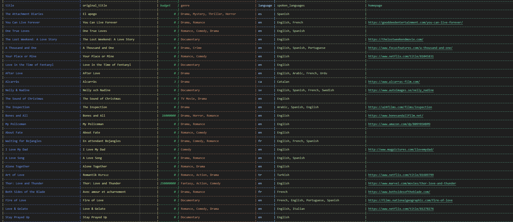

# data-sourcing-challenge

## Description

In this project, we prepare data for a recommendation system that helps users find movie reviews and related movies.  
We do this by getting data from two sources:

1. The New York Times API for movie reviews
2. The Movie Database API for detailed movie information.  

The goal is to merge and clean this data into a single CSV file. 

## Table of Contents
- [Usage](#usage)
- [Credits](#credits)
- [Screenshot](#screenshot)

## Usage

1. **Clone the Repository**: 
    - Start by cloning the repository to your local machine.
    - `git clone <repository>`

2. **Install Dependencies:**
    - Install the required Python package to read `.env` file.
    - `pip install python-dotenv`

3. **Set Up API Keys:**
    - Create accounts with The **New York Times** and **The Movie Database** to obtain API keys.  
    - Open the `.env` file in the root directory (create one if it doesn't exist) and add your API keys like this:
    ```python
    NYT_API_KEY="YOUR_API_KEY"
    TMDB_API_KEY="YOUR_API_KEY"
    ```

4. **Run the Notebook:**
    - Open `retrieve_movie_data.ipynb` in Jupyter Notebook or any compatible environment.
    - Follow the notebook and execute for data retrieval, processing, and merging steps.

## Credits

Starter code for this assignment was provided by [edX bootcamp](https://www.edx.org/boot-camps).

API Credits:
- [New York Times API](https://developer.nytimes.com/docs/articlesearch-product/1/overview)
- [The Movie Database API](https://developer.themoviedb.org/docs/getting-started)


## Screenshot

>**Notebook Preview...**

<br> <p align="center"> 

</p>
